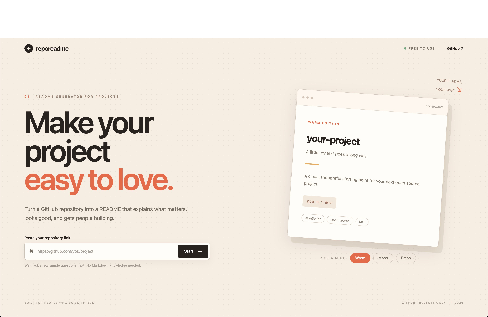
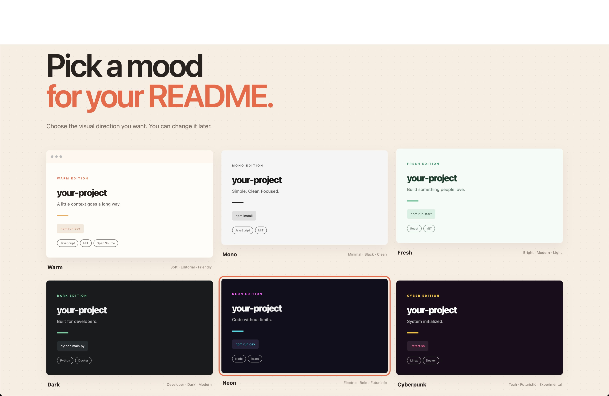
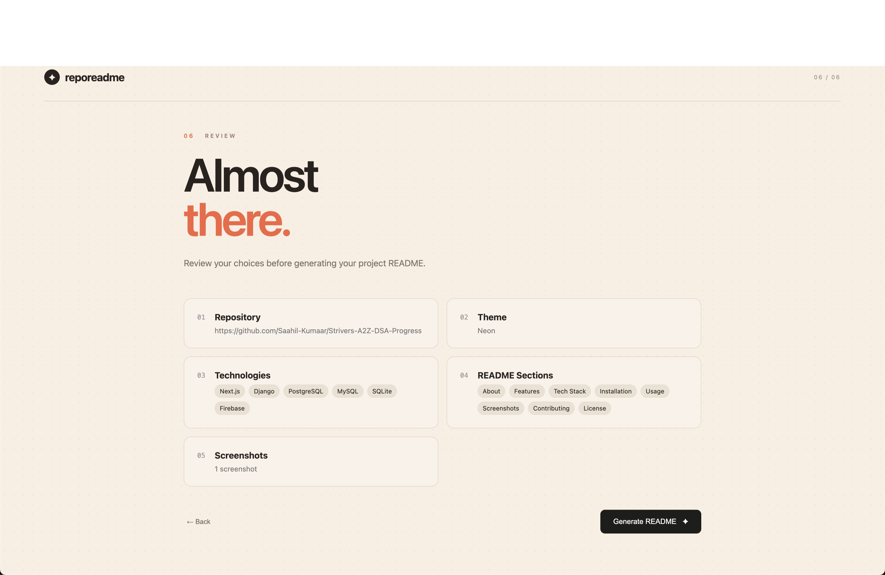
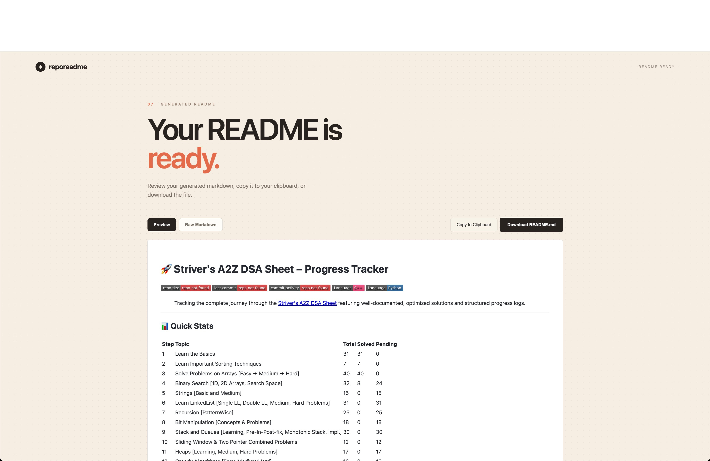

# RepoReadme AI 🤖✨


> 🚀 Turn any GitHub repository into a README people actually want to read.

RepoReadme AI turns a public GitHub repository into a polished, project-specific
`README.md`. It analyzes repository metadata and selected source/configuration
files, asks for the README's style and content preferences, and sends the
resulting context to Gemini for documentation generation.

## 🧰 Technology Stack

| Technology | Role | Official link and badge |
| --- | --- | --- |
| [Python](https://www.python.org/) | Application language | [](https://www.python.org/) |
| [Django](https://www.djangoproject.com/) | Web framework and API routing | [](https://www.djangoproject.com/) |
| [Google Gemini](https://ai.google.dev/) | README generation | [](https://ai.google.dev/) |
| [GitHub REST API](https://docs.github.com/en/rest) | Repository metadata and file access | [](https://docs.github.com/en/rest) |
| [JavaScript](https://developer.mozilla.org/en-US/docs/Web/JavaScript) | Browser interactions and wizard state | [](https://developer.mozilla.org/en-US/docs/Web/JavaScript) |
| [SQLite](https://www.sqlite.org/) | Local development database | [](https://www.sqlite.org/) |

## 📸 Screenshots

Screenshots of the main workflow belong here. Add captured images to
`docs/screenshots/` and keep the filenames below so the gallery stays easy to
maintain:

### 🏠 Home and Repository Input

<!-- Add: docs/screenshots/home.png -->


### 🎨 README Customization Wizard

<!-- Add: docs/screenshots/theme.png and docs/screenshots/review.png -->



### ✅ Generated README Result

<!-- Add: docs/screenshots/result.png -->



## 🏗️ System Architecture

```text
+------------------+        +--------------------------+
| 👤 Browser User   |       | 🖥️ Django Web App        |
| GitHub URL        | ----> | Wizard + JSON endpoints |
+------------------+        +-----------+--------------+
                                        |
                          +-------------+-------------------------+
                          |                                       |
                          v                                       v
                   +-------------------+                    +-------------------+
                   | 🐙 GitHub REST API |                    | 💾 SQLite          |
                   | metadata + files  |                    | local Django data  |
                   +---------+---------+                    +-------------------+
                          |
                          v
                   +-------------------------+
                   | 🧹 Repository Analyzer  |
                   | select files + context  |
                   +------------+------------+
                            |
                            v
                   +-------------------------+       +-------------------+
                   | ✨ AI Service            | ----> | 🤖 Gemini API      |
                   | prompt + preferences    |       | README generation |
                   +------------+------------+       +-------------------+
                            |
                            v
                   +-------------------------+
                   | 📄 Markdown Result      |
                   | preview / copy / save   |
                   +-------------------------+
```

### 🔁 Request Flow

1. The browser stores wizard choices in `localStorage`.
2. Django validates the repository URL and requests metadata from GitHub.
3. The repository analyzer filters the tree and fetches important project files.
4. The AI service combines metadata, source context, and preferences into a
  structured prompt.
5. Gemini returns raw Markdown, which the results page renders and exposes for
  copying or downloading.

## ✨ Features

- 🔗 GitHub repository URL validation and metadata collection
- 🌲 Repository tree inspection with filtering for useful project files
- 🎨 Wizard flow for theme, technologies, sections, screenshots, and custom notes
- ✨ Gemini-powered README generation
- 👀 Markdown preview and raw Markdown view
- 📋 Copy-to-clipboard and `README.md` download actions
- 🛡️ Explicit handling for invalid GitHub tokens, GitHub rate limits, and temporary
  Gemini availability errors

## 📋 Requirements

- Python 3.10 or newer
- A GitHub token with read access to the repositories you want to analyze
- A Gemini API key with access to a supported generative model

The application is intended for local development. Do not commit `.env`, API
keys, GitHub tokens, the local SQLite database, or the virtual environment.

## 📦 Installation

Clone the repository and enter the project directory:

```bash
git clone <your-repository-url>
cd repo-readme-ai
```

Create and activate a virtual environment:

```bash
python3 -m venv venv
source venv/bin/activate
```

On Windows PowerShell, activate it with:

```powershell
venv\Scripts\Activate.ps1
```

Install the Python dependencies:

```bash
python -m pip install --upgrade pip
pip install -r requirements.txt
```

## 🔐 Environment Setup

Create your local environment file from the example:

```bash
cp .env.example .env
```

Edit `.env` and provide real credentials:

```env
GITHUB_TOKEN="your-github-token"
GEMINI_API_KEY="your-gemini-api-key"
GEMINI_MODEL="gemini-3.6-flash"
GEMINI_FALLBACK_MODEL="gemini-3.5-flash-lite"
```

### 🔑 GitHub Token Permissions

For public repositories, a fine-grained token should have repository metadata and
contents read access. If you analyze private repositories, grant access only to
the specific repositories required by the application.

### 🤖 Gemini Model Configuration

`GEMINI_MODEL` is the primary model. `GEMINI_FALLBACK_MODEL` is tried when the
primary model temporarily returns a `503` availability error. Both models must
be enabled for the configured Gemini key.

Never paste credentials into source files, commits, screenshots, issues, or
chat. Revoke and replace any credential that has been exposed.

## 💾 Database Setup

The current application does not define custom database models, but Django's
standard applications require their migrations for a normal local setup:

```bash
python manage.py migrate
```

## ▶️ Running Locally

Run Django's development server:

```bash
python manage.py runserver
```

Open <http://127.0.0.1:8000/> in your browser.

## 🧭 Usage

1. Paste a GitHub repository URL on the home page.
2. Continue through the theme, technology, section, and screenshot steps.
3. Review the selected options.
4. Choose **Generate README**.
5. Review the generated Markdown, copy it, or download it as `README.md`.

The browser stores the wizard selections in `localStorage` until they are
replaced or cleared. The server uses the selected repository URL to fetch
metadata and source context before calling Gemini.

## 🔌 API Endpoints

| Method | Endpoint | Purpose |
| --- | --- | --- |
| `GET` | `/` | Home page |
| `GET` | `/repository/` | Repository step |
| `GET` | `/theme/` | Theme step |
| `GET` | `/technologies/` | Technology step |
| `GET` | `/sections/` | README sections step |
| `GET` | `/screenshots/` | Screenshots step |
| `GET` | `/review/` | Review step |
| `GET` | `/result/` | Generated README page |
| `GET` | `/api/github/analyze/?url=...` | Analyze a GitHub repository |
| `POST` | `/api/generate/` | Generate a README from repository context |

The generation endpoint accepts JSON with `url`, `theme`, `technologies`,
`sections`, `screenshots`, and `custom_notes` fields.

## 🧪 Validation

Run Django's system checks:

```bash
python manage.py check
```

Check JavaScript syntax where Node.js is available:

```bash
node --check generator/static/generator/js/result.js
```

## 🗂️ Project Structure

```text
config/                         Django project configuration
generator/                      README generator application
  ai_service.py                 Gemini client and prompt construction
  github_api.py                 GitHub API integration
  repository_analyzer.py        File selection and context construction
  views.py                      HTML pages and JSON API endpoints
  templates/generator/           Wizard page templates
  static/generator/              CSS and browser JavaScript
manage.py                       Django command-line entry point
requirements.txt                Python dependencies
.env.example                    Environment variable template
```

## 🛠️ Troubleshooting

### 🔑 GitHub Token Is Invalid or Expired

Create a new token, update `.env`, stop the existing Django process, and start
it again. An already-running process does not automatically receive changes to
its environment.

### ⏱️ GitHub API Rate Limit Exceeded

Use an authenticated GitHub token and restart Django after updating `.env`. The
application returns the rate-limit reset timestamp when GitHub provides one.

### 🤖 Gemini Is Temporarily Unavailable

The service retries temporary `503` responses and then tries the configured
fallback model. Retry after a short wait, or configure another enabled model in
`.env`.

## 🛡️ Security Notes

- Keep `.env` local and out of version control.
- Revoke exposed GitHub and Gemini credentials immediately.
- Use least-privilege GitHub token permissions.
- Set `DEBUG = False`, configure `ALLOWED_HOSTS`, and use a production WSGI or
  ASGI server before deploying publicly.

## 📄 License

No license has been specified yet. Add a license file before distributing the
project.
